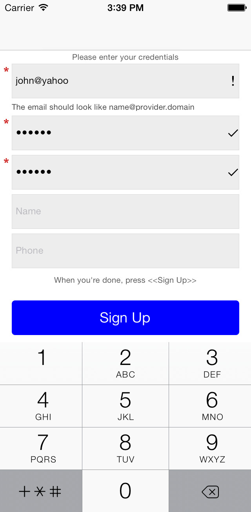
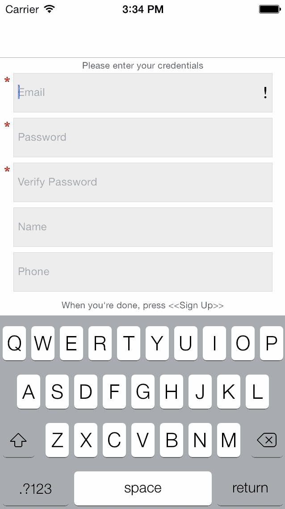
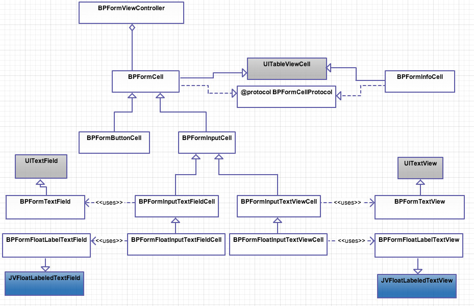

BPForms
=======
[](https://travis-ci.org/bpoplauschi/BPForms)
[](http://cocoadocs.org/docsets/BPForms/)
[](http://cocoadocs.org/docsets/BPForms/)
[](https://www.apache.org/licenses/LICENSE-2.0.html)

Dynamic forms for iPhone/iPad - iOS 6, 7 and later (inspired from [BZGFormViewController](https://github.com/benzguo/BZGFormViewController)).

Now integrated with the well known [JVFloatLabeledTextField](https://github.com/jverdi/JVFloatLabeledTextField).

<p align="left" >
  
  
</p>

### Forms design
- check out a [good article about forms design](http://www.nngroup.com/articles/form-design-placeholders/).

## How to get started

### install via CocoaPods
```ruby
platform :ios, '6.0'
pod 'BPForms'
```

## Requirements

- Xcode4 and above
- iOS 6.0 or above

## Architecture

#### Form
- ```BPFormViewController```

#### Cells
- ```BPFormCell``` implements ```BPFormCellProtocol```
  - ```BPFormInputCell``` - "abstract class" and base class for all input cells
    - ```BPFormInputTextFieldCell``` uses ```BPFormTextField```
      - ```BPFormFloatInputTextFieldCell``` uses ```BPFormFloatLabelTextField```
    - ```BPFormInputTextViewCell``` uses ```BPFormTextView```
      - ```BPFormFloatInputTextViewCell``` uses ```BPFormFloatLabelTextView```
  - ```BPFormButtonCell```
- ```BPFormInfoCell``` implements ```BPFormCellProtocol```

#### Appearance
- ```BPAppearance```

#### Class Diagram

Check the [detailed class diagram](BPFormsDetailedClassDiagram.jpeg).

<p align="left" >
  
</p>

## Dependencies
- [Masonry](https://github.com/cloudkite/Masonry)
- [JVFloatLabeledTextField](https://github.com/jverdi/JVFloatLabeledTextField)

## Demo

Go to /Example, run ```pod install```, and run the target from BPFormsExample.xcworkspace

## Usage

For any form you create, you should subclass ```BPFormViewController``` or just instantiate it.

#### Create an input cell

You can create simple input cells (```BPFormInputTextFieldCell```) or input cells where the label floats above the text value (```BPFormFloatInputTextFieldCell``` - see screenshot).

Just set the properties you need and make sure you set the ```BPFormViewController``` instance as delegate for the ```textField```.
```shouldChangeBlock``` is used to verify the data entered, so please add the verification code (see example).

```objectivec
BPFormFloatInputTextFieldCell *emailCell = [[BPFormFloatInputTextFieldCell alloc] init];
emailCell.textField.placeholder = @"Email";
emailCell.textField.delegate = self;
emailCell.customCellHeight = 50.0f;
emailCell.mandatory = YES;
emailCell.shouldChangeTextBlock =
        BPValidateBlockWithPatternAndMessage(
            @"[A-Z0-9a-z._%+-]+@[A-Za-z0-9.-]+\\.[A-Za-z]{2,4}",
            @"The email should look like name@provider.domain");
```

#### Create a button cell

```objectivec
BPFormButtonCell *signUpCell = [[BPFormButtonCell alloc] init];
signUpCell.button.backgroundColor = [UIColor blueColor];
[signUpCell.button setTitle:@"Sign Up" forState:UIControlStateNormal];
signUpCell.button.layer.cornerRadius = 4.0;
signUpCell.button.layer.masksToBounds = YES;
signUpCell.buttonActionBlock = ^(void){
    NSLog(@"Button pressed");
};
```

#### Add all the cells to the form controller

- keep in mind ```formCells``` contains an array of sections, each sections with its cells

```objectivec
self.formCells = @[@[emailCell, passwordCell, password2Cell, nameCell, phoneCell], @[signUpCell]];
```

#### Add section header or footer

```objectivec
[self setHeaderTitle:@"Please enter your credentials" forSection:0];
[self setFooterTitle:@"When you're done, press <<Sign Up>>" forSection:0];
```

#### Tweak appearance

- use the BPAppearance class to customize the way the forms look

```objectivec
// fonts
[BPAppearance sharedInstance].infoCellLabelFont = [UIFont systemFontOfSize:12];

// colors
[BPAppearance sharedInstance].headerFooterLabelTextColor = [UIColor lightGray];

// sizes
[BPAppearance sharedInstance].infoCellHeight = 25;
```

## Author
- [Bogdan Poplauschi](https://github.com/bpoplauschi)

## License
- BPForms is available under the [MIT license](LICENSE).
